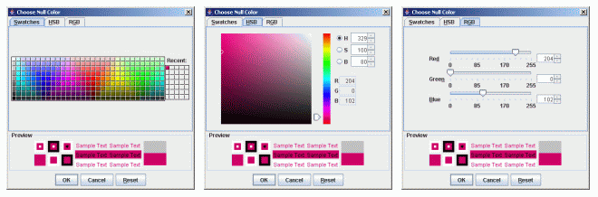
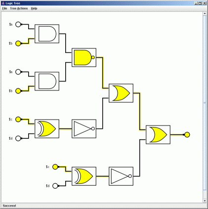

Logic Tree v1.0 Documentation
=============================


Table of Contents
-----------------

-   [Program Information](#program-information)
-   [Expression Parser Syntax](#expression-parser-syntax)
-   [Creating a New Expression tree](#creating-a-new-expression-tree)
-   [Animating the Expression Tree](#animating-the-expression-tree)
-   [Changing the Display Colors](#changing-the-display-colors)
-   [Exporting an Image](#exporting-an-image)
-   [Displaying the Truth Table](#displaying-the-truth-table)
-   [Contact and Support](#contact-and-support)

Program Information
-------------------


Logic Tree is a free program for modeling complex logic gate networks. Logic Tree displays and animates representations of Boolean expressions inputted by the user. This program is free to edit and redistribute under the conditions outlined in the [GNU General Public License](http://www.gnu.org/copyleft/gpl.html) agreement.

Expression Parser Syntax
------------------------

Logic Tree's expression parser accepts Boolean algebra expressions written in infix notation. There are eight supported Boolean operators:

| Symbol | Function                    | Symbol | Function                             |
|--------|-----------------------------|--------|--------------------------------------|
| AND    | Binary And Operator         | OR     | Binary Or Operator                   |
| NAND   | Inverse Binary And Operator | NOR    | Inverse Binary Or Operator           |
| NOT    | Unary Not Operator          | XOR    | Binary Exclusive Or Operator         |
| ( )    | Parenthesis                 | NXOR   | Inverse Binary Exclusive Or Operator |

Operator precedence from lowest to highest is: `XOR`/`NXOR`, `OR`/`NOR`, `AND`/`NAND`, `NOT`, `(` `)`. Each operator can take constants, variables, or parenthesized expressions as operands. A variable is denoted by a `$` (dollar sign) followed by any number of alpha-numeric characters. Some examples of variable names are `$a`, `$1`, `$3apples`, and `$number25`. The two constant values of true and false are represented by `$_TRUE` and `$_FALSE`. Here are some examples of valid expressions:

```
($_TRUE XOR $_FALSE) NAND $apples OR $oranges

$_TRUE

$variable325

($a AND $b OR $c XOR $a AND $b) AND (($c XOR $a AND $b) OR $a AND $b)
```

Creating a New Expression Tree
------------------------------

1.  Begin by clicking the <var>File</var> menu and select the <var>New Logic Tree</var> option.

    

2.  Enter a Boolean expression into the dialog box using the [proper syntax](#syntax).

    

3.  The expression tree should now be displayed in the window! Resize and scroll as necessary.

    

Changing Input Values
---------------------

1.  After [creating an expression tree](#newTree), click the <var>Tree Actions</var> menu and select the <var>Edit Variables</var> option.

    

2.  You should now see a dialog window with all your variable names next to checkboxes. All variable values default to true, so all the checkboxes should start out checked. If you want to switch any values to false simply uncheck the box next to the variable's name. If you want the changes to apply hit OK, and if not, hit Cancel.

    

3.  If you hit OK then the input displays will be updated, red for false and blue for true.

    

Animating the Expression Tree
-----------------------------

1.  Begin by <var>Tree Actions</var> menu and selecting the <var>Animate Tree</var> option.

    

2.  Now wait as the expression tree animates the different values passing through the gates.

    

3.  You can reset the display after (or during) the animation by clicking the <var>Tree Actions</var> menu and selecting the <var>Reset Tree</var> option. Resetting while the animation is running will stop it.

    

Changing the Display Colors
---------------------------

1.  To change the default colors for the display components in the expression tree click the <var>File</var> menu and select the <var>Color Options</var> option. (Note: this must be done *before* you create a new expression tree otherwise you will be unable to edit the colors)

    

2.  When the dialog appears it will have 3 buttons along the top filled with the current values for drawing true, false, and null values. Click one of these buttons to edit the default color.

    

3.  Use one of the three Color Chooser tabs to select a new color and then hit OK.

    

4.  Once you've decided on your colors click OK to set them or Cancel to void the changes.

    

5.  Now you have a custom color-scheme for the expression tree display and animation!

    

Exporting an Image
------------------

1.  To export an image of the display click the <var>File</var> menu and select the <var>Export Image</var> option.

    

2.  In the Save dialog, navigate to where you want your image saved and type in a name. All image files are saved in [PNG format](http://en.wikipedia.org/wiki/PNG).

    

Displaying the Truth Table
--------------------------

1.  To display your expression tree's truth table, click the <var>File</var> menu and select the <var>Show Truth Table</var> option.

    

2.  Your default browser should then open to display the truth table in HTML format and you can use your browser to save a copy of the truth table for future use.

    

3.  Using the "Web Page, HTML Only" option while saving is recommended over "Web Page, Complete" since the truth table contains no external objects.

    

Contact and Support
-------------------

If you have any questions, concerns, suggestions, or a bug to report, please visit <http://ouuuuch.phoenixteam.org/>.

Copyright &copy; 2006 Nick Vrvilo
